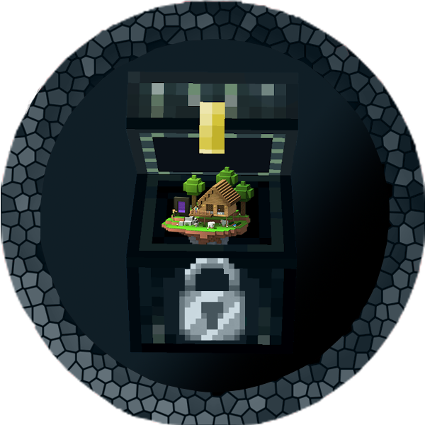

# Pocket dimensions NeoForge mod

## Description

PocketHome is a mod that adds worlds for players to live in and where they can build freely.
## Build

Get the source from GitHub and build it with Gradle:

```shell
git clone https://github.com/IPOleksenko/PocketHome_for_NeoForge.git
cd PocketHome_for_NeoForge/
./gradlew build
```

## Contributing

Pull requests are welcome. For major changes, please open an issue first
to discuss what you would like to change.

## Authors

- [IPOleksenko](https://github.com/IPOleksenko) (owner)

## License

This project is licensed under the [MIT License][license].

[license]: ./LICENSE
